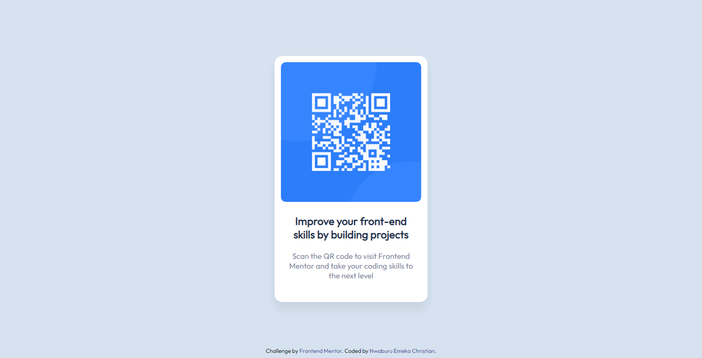

# Frontend Mentor - QR code component solution

This is a solution to the [QR code component challenge on Frontend Mentor](https://www.frontendmentor.io/challenges/qr-code-component-iux_sIO_H). Frontend Mentor challenges help you improve your coding skills by building realistic projects.

## Table of contents

- [Overview](#overview)
  - [Screenshot](#screenshot)
  - [Links](#links)
- [My process](#my-process)
  - [Built with](#built-with)
  - [What I learned](#what-i-learned)
  - [Continued development](#continued-development)
- [Author](#author)

## Overview
This is my very second project after completing Module 3 of Angela Yu's web design class. I enjoyed it! Took me roughly 2 hours to complete.
### Screenshot

### Links

- Solution URL: [Solution](https://christone007.github.io/qr-code-component/)

## My process
Starting with laying out the Web Version and then made it responsive.

### Built with
- HTML5
- CSS3

### What I learned
As a newbie, I had a tough time centering the container div and making it responsive got me reading about media queries.

### Continued development
I would want to learn more about responsive web design

## Author
- Frontend Mentor - [@Christone007](https://www.frontendmentor.io/profile/Christone007)
- Twitter - [@EmekaNwaburu](https://www.twitter.com/Christone)
